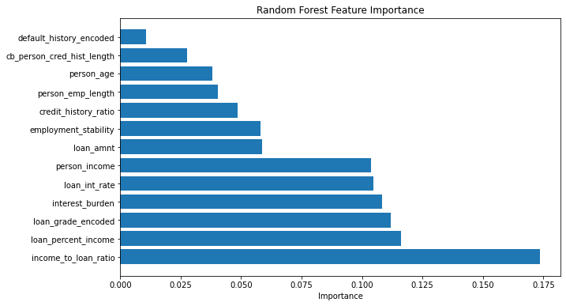

# Credit Risk Prediction

Machine learning project for predicting borrower default risk using borrower demographics, loan characteristics, and engineered financial indicators.

## Project Overview

This project develops and evaluates machine learning models for credit risk assessment using structured lending data.

The workflow includes:

- Data cleaning and preprocessing
- Exploratory data analysis
- Feature engineering
- Logistic Regression modeling
- Random Forest modeling
- Model evaluation
- Feature importance analysis

## Dataset

The dataset contains borrower-level lending information, including:

- Borrower age
- Annual income
- Employment length
- Loan amount
- Interest rate
- Loan grade
- Home ownership status
- Loan purpose
- Credit history length

Target variable:

- `loan_status`
  - `0` = Non-default
  - `1` = Default

After cleaning, the dataset contains 31,521 borrower records.

## Project Structure

- `01_data_cleaning_eda.ipynb`
- `02_feature_engineering.ipynb`
- `03_modeling_evaluation.ipynb`
- `feature_importance.png`

## Data Cleaning

Key preprocessing steps included:

- Removing unrealistic borrower ages
- Removing unrealistic employment lengths
- Removing duplicated records
- Treating missing values
- Assessing data quality issues

## Exploratory Data Analysis

Key findings:

- Default rate is approximately 22%.
- Non-default rate is approximately 78%.
- Lower-income borrowers show higher default rates.
- Poorer loan grades show substantially higher default probabilities.
- Higher interest rates are associated with elevated default risk.

## Feature Engineering

Several borrower-level risk indicators were created:

### Income-to-Loan Ratio

Measures borrower affordability.

`person_income / loan_amnt`

Higher values generally indicate stronger repayment capacity.

### Credit History Ratio

Measures credit maturity relative to borrower age.

`cb_person_cred_hist_length / person_age`

### Employment Stability

Measures employment experience relative to borrower age.

`person_emp_length / person_age`

### Interest Burden

Measures repayment burden relative to borrower income.

`loan_int_rate / person_income`

## Models

### Logistic Regression

Used as a baseline classification model.

Results:

- Accuracy: 80.8%
- Recall for default borrowers: 17%

Although overall accuracy was reasonable, the model struggled to identify default borrowers.

### Random Forest

Used to capture non-linear borrower risk patterns.

Results:

- Accuracy: 87.4%
- Recall for default borrowers: 62%

The Random Forest model significantly outperformed Logistic Regression in identifying high-risk borrowers.

## Model Comparison

| Model | Accuracy | Recall for Default Borrowers |
|---|---:|---:|
| Logistic Regression | 80.8% | 17% |
| Random Forest | 87.4% | 62% |

## Feature Importance

The most important predictive features were:

1. Income-to-loan ratio
2. Loan percent income
3. Loan grade
4. Interest burden
5. Loan interest rate

These results suggest that borrower repayment capacity is one of the strongest drivers of default risk.

## Key Findings

- Random Forest substantially outperformed Logistic Regression.
- Borrower affordability metrics were the strongest predictors of default.
- Loan burden relative to income plays a critical role in repayment performance.
- Feature engineering improved model interpretability and predictive power.

## Technologies

- Python
- Pandas
- NumPy
- Matplotlib
- Seaborn
- Scikit-Learn
- Jupyter Notebook

## Future Improvements

Potential future enhancements include:

- XGBoost or Gradient Boosting models
- Hyperparameter optimization
- Cross-validation
- Probability calibration
- SHAP explainability analysis
- Production deployment pipeline
